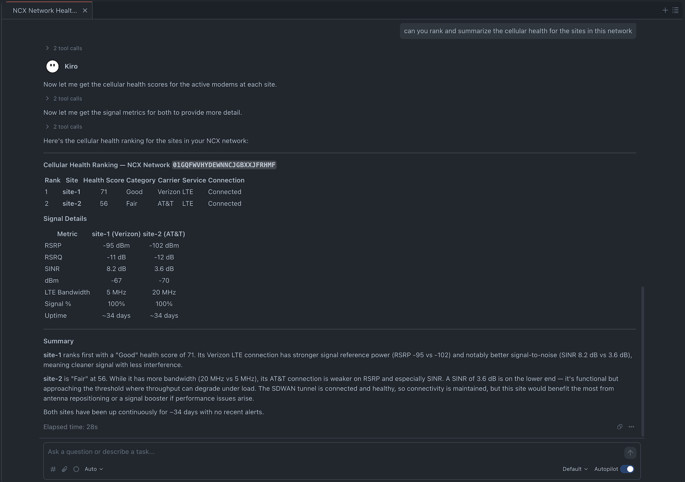

# NCM MCP Servers



A suite of three focused MCP (Model Context Protocol) servers for the Ericsson Enterprise Wireless NCM API, split by domain responsibility for optimal LLM tool selection.

## Architecture

| Server | Port | Domain | Tools |
|--------|------|--------|-------|
| `ncm-fleet` | 3001 | Routers, groups, accounts, locations, configurations, firmware, products | 17 |
| `ncm-monitoring` | 3002 | Net devices, alerts/logs, speed tests | 6 |
| `ncm-cloud-services` | 3003 | Users, subscriptions, private cellular, exchange | 13 |

All servers default to **Streamable HTTP transport** and run together in a single container.

## Quick Start

### 1. Install

```bash
cd ncm_mcp_servers
pip install -e .
```

### 2. Configure Credentials

Copy the example and fill in your values:

```bash
cp credentials.example.json credentials.json
```

```json
{
    "X_CP_API_ID": "your-cp-api-id",
    "X_CP_API_KEY": "your-cp-api-key",
    "X_ECM_API_ID": "your-ecm-api-id",
    "X_ECM_API_KEY": "your-ecm-api-key",
    "NCM_API_TOKEN": "your-v3-bearer-token"
}
```

Alternatively, set environment variables with the same names.

### 3. Run (Docker — recommended)

```bash
docker compose up --build
```

Or build and run manually:

```bash
docker build -t ncm-mcp-servers .
docker run -p 3001:3001 -p 3002:3002 -p 3003:3003 \
  -v ./credentials.json:/app/credentials.json:ro \
  ncm-mcp-servers
```

This starts a single container running all 3 servers:
- `http://localhost:3001/mcp` — ncm-fleet
- `http://localhost:3002/mcp` — ncm-monitoring
- `http://localhost:3003/mcp` — ncm-cloud-services

### 4. Run (Local, without Docker)

```bash
# Run all 3 servers in a single process (recommended for local dev)
ncm-mcp-servers

# Or via python module
python -m ncm_mcp_servers
```

Run servers individually if you only need a subset:

```bash
ncm-fleet            # port 3001
ncm-monitoring       # port 3002
ncm-cloud-services   # port 3003
```

Override ports via environment variables:
```bash
NCM_FLEET_PORT=4001 ncm-fleet
NCM_MONITORING_PORT=4002 ncm-monitoring
NCM_CLOUD_SERVICES_PORT=4003 ncm-cloud-services
```

### 5. Transport Options

The default transport is **Streamable HTTP**. Supported transports:

| Transport | Value | Use case |
|-----------|-------|----------|
| Streamable HTTP | `streamable-http` (default) | Recommended for all MCP clients |
| SSE | `sse` | Legacy MCP clients using Server-Sent Events |
| Stdio | `stdio` | Piped MCP clients (single server only) |

```bash
# Use SSE transport (legacy)
MCP_TRANSPORT=sse ncm-mcp-servers

# Use stdio (only works with individual servers, not the unified runner)
MCP_TRANSPORT=stdio ncm-fleet
```

## MCP Client Configuration

Add to your MCP settings (e.g. `.kiro/settings/mcp.json`):

```json
{
  "mcpServers": {
    "ncm-fleet": {
      "url": "http://localhost:3001/mcp"
    },
    "ncm-monitoring": {
      "url": "http://localhost:3002/mcp"
    },
    "ncm-cloud-services": {
      "url": "http://localhost:3003/mcp"
    }
  }
}
```

## Tool Consolidation Strategy

CRUD operations are consolidated into `manage_*` tools with an `action` parameter:

```python
manage_router(action="rename", router_id=123, new_name="foo")
manage_router(action="delete", router_id=123)
manage_router(action="update", router_id=123, description="bar")
```

Read-only metrics are consolidated by type:

```python
get_net_device_metrics(metric_type="signal", net_device=1)
get_net_device_metrics(metric_type="usage", net_device=1)
get_net_device_metrics(metric_type="wan", net_device=1)
get_net_device_metrics(metric_type="modem", net_device=1)
```

## Project Structure

```
ncm_mcp_servers/
├── pyproject.toml
├── Dockerfile
├── docker-compose.yml
├── entrypoint.sh
├── credentials.example.json
├── credentials.json          # Your credentials (gitignored)
├── ncm_mcp_servers/
│   ├── shared/               # Common utilities
│   │   ├── ncm.py            # NCM API client library
│   │   ├── credentials.py    # Credential loading
│   │   ├── error_handler.py  # Response/error formatting
│   │   └── client.py         # NCM client factory
│   ├── ncm_fleet/            # Fleet management server (port 3001)
│   │   ├── server.py
│   │   └── tools/
│   │       ├── routers.py
│   │       ├── groups.py
│   │       ├── accounts.py
│   │       ├── locations.py
│   │       ├── configurations.py
│   │       └── firmware.py
│   ├── ncm_monitoring/       # Monitoring server (port 3002)
│   │   ├── server.py
│   │   └── tools/
│   │       ├── net_devices.py
│   │       ├── alerts.py
│   │       └── speed_tests.py
│   └── ncm_cloud_services/   # Cloud services server (port 3003)
│       ├── server.py
│       └── tools/
│           ├── users.py
│           ├── subscriptions.py
│           ├── private_cellular.py
│           └── exchange.py
└── README.md
```

## Tool Reference

### ncm-fleet (17 tools)

| Tool | Description |
|------|-------------|
| `get_routers` | Query routers by ID, name, account, or group |
| `manage_router` | Rename, delete, update fields, assign to group/account, remove from group |
| `reboot_router` | Reboot a single router |
| `reboot_group` | Reboot all routers in a group |
| `get_groups` | Query groups by ID, name, or account |
| `manage_group` | Create, rename, delete, update groups |
| `get_accounts` | Query accounts by ID or name |
| `manage_subaccount` | Create, rename, delete subaccounts |
| `get_locations` | Query current or historical locations |
| `manage_location` | Create or delete router locations |
| `get_configuration_managers` | Query config sync status |
| `patch_config` | Partial config update (router or group) |
| `put_router_config` | Full config replacement |
| `copy_router_config` | Copy config between routers |
| `resume_updates` | Resume suspended config sync |
| `get_firmware` | Query firmware versions by product |
| `get_products` | Query product catalog |

### ncm-monitoring (6 tools)

| Tool | Description |
|------|-------------|
| `get_net_devices` | Query net devices by router, mode, connection state |
| `get_net_device_health` | Get cellular health scores |
| `get_net_device_metrics` | Signal, usage, WAN, or modem metrics |
| `get_logs` | Alerts, recent alerts, router logs, or activity logs |
| `create_speed_test` | Run speed test on devices or all modems on a router |
| `get_speed_test` | Get speed test status and results |

### ncm-cloud-services (13 tools)

| Tool | Description |
|------|-------------|
| `get_users` | Query NCM users |
| `manage_user` | Create, update, delete users, change role |
| `get_subscriptions` | Query subscriptions |
| `manage_subscription` | Regrade or unlicense devices |
| `get_networks` | Query private cellular networks |
| `manage_network` | Create, update, delete networks |
| `get_radios` | Query radios and operational status |
| `manage_radio` | Update radio settings |
| `manage_sim` | Query or update SIMs |
| `get_exchange_sites` | Query exchange sites |
| `manage_exchange_site` | Create, update, delete sites |
| `get_exchange_resources` | Query exchange resources |
| `manage_exchange_resource` | Create, update, delete resources |
